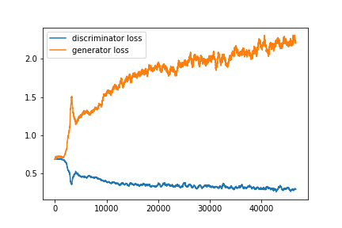
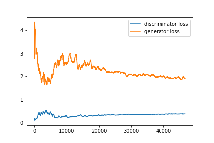
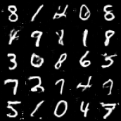
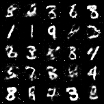

# GAN Survey

## 1/- Introduction
In this project, we train two GAN [1] models on MNIST [2] dataset.

## 2/- Requirements
* Python (3.6)
* PyTorch deep learning framework(1.2.0)
* Torchvision (0.4.0)
* The training was done on an GPU Nvidia GTX1050 

## 3/- Usage
To reproduce the results run:

  ```
  python3 main.py --architecture dcgan
  python3 main.py --architecture dense
  ```
  
## 4/- Results 
### 4.1. Loss

<p float="center">
  
   
</p>


</p>

### 4.2.Samples


<p align="center">
  
  
</p>

## 5/- Referencees

[1] ian Goodfellow et al. “Generative Adversarial Nets”. In:Advances in
Neural Information Processing Systems 27.Ed. by Z. Ghahramani et al.
Curran Associates, Inc., 2014, pp. 2672–2680.

    @incollection{NIPS2014_5423,
    title = {Generative Adversarial Nets},
    author = {Goodfellow, Ian and Pouget-Abadie, Jean and Mirza, Mehdi and Xu, Bing and Warde-Farley, David and Ozair, Sherjil and Courville, Aaron and Bengio, Yoshua},
    booktitle = {Advances in Neural Information Processing Systems 27},
    editor = {Z. Ghahramani and M. Welling and C. Cortes and N. D. Lawrence and K. Q. Weinberger},
    pages = {2672--2680},
    year = {2014},
    publisher = {Curran Associates, Inc.},
    url = {http://papers.nips.cc/paper/5423-generative-adversarial-nets.pdf}
    }
    
[2] Yann LeCun and Corinna Cortes. “MNIST handwritten digit database”.
In: (2010).

    @article{lecun-mnisthandwrittendigit-2010,
    added-at = {2010-06-28T21:16:30.000+0200},
    author = {LeCun, Yann and Cortes, Corinna},
    biburl = {https://www.bibsonomy.org/bibtex/2935bad99fa1f65e03c25b315aa3c1032/mhwombat},
    groups = {public},
    howpublished = {http://yann.lecun.com/exdb/mnist/},
    interhash = {21b9d0558bd66279df9452562df6e6f3},
    intrahash = {935bad99fa1f65e03c25b315aa3c1032},
    keywords = {MSc _checked character_recognition mnist network neural},
    lastchecked = {2016-01-14 14:24:11},
    timestamp = {2016-07-12T19:25:30.000+0200},
    title = {{MNIST} handwritten digit database},
    url = {http://yann.lecun.com/exdb/mnist/},
    username = {mhwombat},
    year = 2010
    }
    


